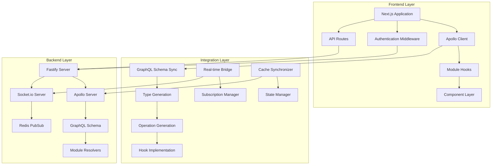
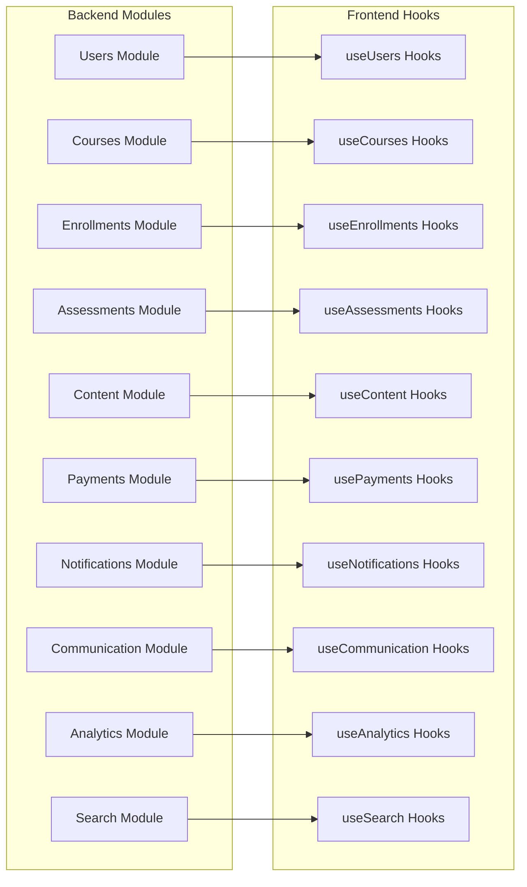

# Design Document: Backend-Frontend Integration

## Overview

This design document outlines the comprehensive architecture and implementation approach for achieving 100% integration between a production-ready Learning Management System backend and a well-architected frontend foundation layer. The solution addresses critical integration gaps while leveraging existing architectural strengths to create a seamless, type-safe, and performant full-stack application.

The backend provides over 100 GraphQL endpoints across 10 major modules with real-time subscriptions, file processing, payments, analytics, and comprehensive authentication. The frontend has excellent architectural foundations including Apollo Client, authentication systems, real-time infrastructure, and modular design patterns. This integration will bridge these systems to create a unified, production-ready platform.

## Architecture

### High-Level Architecture



### Module Integration Architecture

The integration follows a modular approach where each backend module has corresponding frontend hooks and utilities:



## Components and Interfaces

### 1. Schema Integration System

**Purpose**: Automatically synchronize GraphQL schema from backend to frontend and generate TypeScript types.

**Core Components**:

- **Schema Extractor**: Fetches complete schema from running backend server
- **Type Generator**: Uses GraphQL Code Generator to create TypeScript types
- **Operation Generator**: Creates typed GraphQL operations from backend schema
- **Validation System**: Ensures schema compatibility and detects breaking changes

**Key Interfaces**:

```typescript
interface SchemaIntegrationConfig {
  backendEndpoint: string;
  outputPath: string;
  watchMode: boolean;
  validationRules: ValidationRule[];
}

interface GeneratedTypes {
  entities: Record<string, TypeDefinition>;
  inputs: Record<string, InputDefinition>;
  operations: Record<string, OperationDefinition>;
  subscriptions: Record<string, SubscriptionDefinition>;
}
```

### 2. Module Hook System

**Purpose**: Provide comprehensive React hooks for all backend modules with full type safety.

**Architecture Pattern**:
- Each module follows consistent hook patterns
- Hooks provide query, mutation, and subscription capabilities
- Automatic cache integration and optimistic updates
- Error handling and loading states
- Retry logic and offline support

**Hook Categories**:

```typescript
// Query Hooks - Data Fetching
interface QueryHook<T, V = {}> {
  data: T | undefined;
  loading: boolean;
  error: Error | undefined;
  refetch: (variables?: V) => Promise<void>;
  fetchMore?: (options: FetchMoreOptions) => Promise<void>;
}

// Mutation Hooks - Data Modification
interface MutationHook<T, V = {}> {
  mutate: (variables: V) => Promise<T>;
  loading: boolean;
  error: Error | undefined;
  reset: () => void;
}

// Subscription Hooks - Real-time Updates
interface SubscriptionHook<T> {
  data: T | undefined;
  loading: boolean;
  error: Error | undefined;
  connected: boolean;
}
```

### 3. Real-time Integration System

**Purpose**: Connect frontend subscriptions to backend Socket.io and GraphQL subscriptions.

**Components**:

- **WebSocket Manager**: Handles connection lifecycle and authentication
- **Subscription Router**: Routes subscription events to appropriate handlers
- **Cache Integrator**: Updates Apollo Client cache with real-time data
- **Presence Manager**: Tracks user presence and activity states

**Real-time Event Types**:

```typescript
interface RealTimeEvents {
  // Message Events
  MESSAGE_RECEIVED: MessageEvent;
  MESSAGE_UPDATED: MessageUpdateEvent;
  TYPING_INDICATOR: TypingEvent;
  
  // Progress Events
  LESSON_COMPLETED: LessonProgressEvent;
  COURSE_COMPLETED: CourseCompletionEvent;
  ASSESSMENT_GRADED: GradeEvent;
  
  // Notification Events
  NOTIFICATION_RECEIVED: NotificationEvent;
  ANNOUNCEMENT_PUBLISHED: AnnouncementEvent;
  
  // Presence Events
  USER_ONLINE: PresenceEvent;
  USER_OFFLINE: PresenceEvent;
  USER_ACTIVITY: ActivityEvent;
}
```

### 4. Authentication Integration System

**Purpose**: Seamlessly integrate frontend authentication with backend JWT and RBAC systems.

**Components**:

- **Token Manager**: Handles JWT storage, refresh, and expiration
- **Permission Validator**: Validates user permissions and resource access
- **Route Guard**: Protects routes based on authentication and authorization
- **Session Manager**: Manages user sessions and automatic logout

**Authentication Flow**:

```typescript
interface AuthenticationFlow {
  login: (credentials: LoginCredentials) => Promise<AuthResult>;
  logout: () => Promise<void>;
  refreshToken: () => Promise<TokenPair>;
  validatePermission: (resource: string, action: string) => boolean;
  checkResourceOwnership: (resourceId: string, resourceType: string) => Promise<boolean>;
}

interface AuthResult {
  user: User;
  tokens: TokenPair;
  permissions: Permission[];
  expiresAt: Date;
}
```

### 5. File Upload and Content System

**Purpose**: Integrate frontend upload capabilities with backend S3, MediaConvert, and streaming systems.

**Components**:

- **Upload Manager**: Handles file uploads with progress tracking
- **Processing Monitor**: Tracks video processing status
- **Streaming Client**: Generates and manages streaming URLs
- **Asset Manager**: Manages file metadata and access control

**Upload Workflow**:

```typescript
interface UploadWorkflow {
  // Step 1: Request presigned URL
  requestUploadUrl: (fileInfo: FileInfo) => Promise<PresignedUrlResponse>;
  
  // Step 2: Upload to S3
  uploadFile: (file: File, presignedUrl: string) => Promise<UploadResult>;
  
  // Step 3: Process video (if applicable)
  initiateProcessing: (uploadId: string) => Promise<ProcessingJob>;
  
  // Step 4: Monitor processing
  monitorProcessing: (jobId: string) => Observable<ProcessingStatus>;
  
  // Step 5: Generate streaming URLs
  generateStreamingUrl: (assetId: string) => Promise<StreamingUrls>;
}
```

### 6. Cache Integration System

**Purpose**: Synchronize Apollo Client cache with backend data structures and real-time updates.

**Components**:

- **Type Policy Manager**: Configures cache normalization for backend entities
- **Update Coordinator**: Handles cache updates from mutations and subscriptions
- **Invalidation Manager**: Manages cache invalidation based on data relationships
- **Persistence Layer**: Handles cache persistence and restoration

**Cache Configuration**:

```typescript
interface CacheConfiguration {
  typePolicies: Record<string, TypePolicy>;
  updateStrategies: Record<string, UpdateStrategy>;
  invalidationRules: Record<string, InvalidationRule[]>;
  persistenceConfig: PersistenceConfig;
}

interface UpdateStrategy {
  optimisticResponse: (variables: any) => any;
  updateCache: (cache: ApolloCache, result: any) => void;
  onError: (cache: ApolloCache, error: Error) => void;
}
```

## Data Models

### Core Entity Models

The integration maintains consistency between backend and frontend data models through generated TypeScript types:

```typescript
// User Entity
interface User {
  id: string;
  email: string;
  role: UserRole;
  emailVerified: boolean;
  profile: UserProfile;
  notificationPreferences: NotificationPreferences;
  createdAt: string;
  updatedAt: string;
}

// Course Entity
interface Course {
  id: string;
  title: string;
  description: string;
  slug: string;
  category: string;
  difficulty: CourseDifficulty;
  price: number;
  currency: string;
  status: CourseStatus;
  thumbnailUrl?: string;
  instructor: User;
  modules: CourseModule[];
  enrollmentCount: number;
  averageRating: number;
  createdAt: string;
  updatedAt: string;
}

// Assessment Entity
interface Assessment {
  id: string;
  title: string;
  description: string;
  type: AssessmentType;
  courseId: string;
  moduleId?: string;
  questions: Question[];
  timeLimit?: number;
  maxAttempts: number;
  passingScore: number;
  status: AssessmentStatus;
  createdAt: string;
  updatedAt: string;
}
```

### Input and Response Models

```typescript
// Mutation Input Models
interface CreateCourseInput {
  title: string;
  description: string;
  category: string;
  difficulty: CourseDifficulty;
  price?: number;
  currency?: string;
}

interface UpdateProfileInput {
  fullName?: string;
  bio?: string;
  timezone?: string;
  language?: string;
  avatarUrl?: string;
}

// Response Models
interface PaginatedResponse<T> {
  edges: Array<{
    node: T;
    cursor: string;
  }>;
  pageInfo: {
    hasNextPage: boolean;
    hasPreviousPage: boolean;
    startCursor?: string;
    endCursor?: string;
  };
  totalCount: number;
}

interface MutationResponse<T> {
  success: boolean;
  data?: T;
  errors?: Error[];
}
```

### Real-time Event Models

```typescript
// Subscription Event Models
interface MessageEvent {
  id: string;
  conversationId: string;
  senderId: string;
  content: string;
  type: MessageType;
  timestamp: string;
}

interface ProgressEvent {
  userId: string;
  courseId: string;
  lessonId?: string;
  progressPercentage: number;
  completedAt?: string;
  timestamp: string;
}

interface NotificationEvent {
  id: string;
  userId: string;
  type: NotificationType;
  title: string;
  message: string;
  data?: Record<string, any>;
  timestamp: string;
}
```

Now I'll continue with the Correctness Properties section using the prework tool:

<function_calls>
<invoke name="prework">
<parameter name="featureName">backend-frontend-integration

## Correctness Properties

*A property is a characteristic or behavior that should hold true across all valid executions of a system-essentially, a formal statement about what the system should do. Properties serve as the bridge between human-readable specifications and machine-verifiable correctness guarantees.*

### Property Reflection

After analyzing all acceptance criteria, I identified several areas where properties can be consolidated to eliminate redundancy:

- Schema integration properties (1.1, 1.2, 1.3) can be combined into a comprehensive schema synchronization property
- Module hook properties (2.1, 2.2, etc.) follow similar patterns and can be generalized
- Real-time properties (3.1, 3.2) can be combined into a comprehensive subscription property
- Authentication properties (4.1, 4.2) can be combined into a token management property
- File upload properties (5.1, 5.2) can be combined into a content processing property

### Core Integration Properties

**Property 1: Schema Synchronization Integrity**
*For any* running backend server with a valid GraphQL endpoint, the frontend schema integration system should successfully fetch the complete schema, generate corresponding TypeScript types, and replace all placeholder operations with real backend operations, ensuring 100% type coverage.
**Validates: Requirements 1.1, 1.2, 1.3**

**Property 2: Module Hook Completeness**
*For any* backend module with defined GraphQL operations, the frontend should provide corresponding React hooks that expose all available queries, mutations, and subscriptions with proper TypeScript types, error handling, and cache integration.
**Validates: Requirements 2.1, 2.2, 2.3, 2.4, 2.5, 2.6, 2.7**

**Property 3: Real-time Communication Consistency**
*For any* WebSocket connection established with valid authentication, all subscription events should be properly routed to subscribers, cache should be updated automatically, and connection should be maintained with automatic reconnection on failure.
**Validates: Requirements 3.1, 3.2, 3.3, 3.4, 3.5, 3.6, 3.7**

**Property 4: Authentication Token Management**
*For any* valid user authentication, JWT tokens should be properly stored, automatically refreshed before expiration, and used consistently across all GraphQL operations and WebSocket connections without user intervention.
**Validates: Requirements 4.1, 4.2, 4.3, 4.4, 4.5, 4.6**

**Property 5: Content Processing Pipeline**
*For any* file upload operation, the system should generate presigned URLs, handle uploads to S3, initiate processing for video content, monitor processing status, and provide streaming URLs upon completion with proper error handling and retry logic.
**Validates: Requirements 5.1, 5.2, 5.3, 5.4, 5.5, 5.6**

**Property 6: Cache Synchronization Accuracy**
*For any* GraphQL operation or real-time update, the Apollo Client cache should be updated consistently with backend data structures, maintain proper normalization, and invalidate related entries based on entity relationships.
**Validates: Requirements 6.1, 6.2, 6.3, 6.4, 6.5**

**Property 7: Error Handling Consistency**
*For any* error returned by the backend, the frontend should map error codes to user-friendly messages, extract field-level validation errors, report to monitoring systems with proper context, and provide appropriate recovery options.
**Validates: Requirements 7.1, 7.2, 7.3, 7.4, 7.5**

**Property 8: Route Protection Enforcement**
*For any* protected route access attempt, the middleware should validate JWT tokens with the backend, enforce role-based permissions, handle server-side operations appropriately, and redirect unauthorized users consistently.
**Validates: Requirements 8.1, 8.2, 8.3, 8.4, 8.5**

**Property 9: Environment Configuration Consistency**
*For any* deployment environment (development, staging, production), all required configuration values should be properly set, validated on startup, and used consistently across all integration components.
**Validates: Requirements 9.1, 9.2, 9.3, 9.4, 9.5**

**Property 10: Test Coverage Completeness**
*For any* integration component (hooks, utilities, middleware), comprehensive tests should exist covering unit functionality, integration scenarios, error conditions, and real-time features with proper mocking and coverage reporting.
**Validates: Requirements 10.1, 10.2, 10.3, 10.4, 10.5**

**Property 11: Performance Optimization Effectiveness**
*For any* GraphQL operation, the system should implement query optimization, efficient subscription management, proper code splitting, and request deduplication to maintain optimal performance metrics.
**Validates: Requirements 11.1, 11.2, 11.3, 11.4, 11.5**

**Property 12: Security Implementation Completeness**
*For any* user interaction with the system, proper security measures should be enforced including CSRF protection, secure token handling, input validation, CORS configuration, and rate limiting.
**Validates: Requirements 12.1, 12.2, 12.3, 12.4, 12.5**

**Property 13: Content Delivery Optimization**
*For any* content access request, the system should provide optimized delivery through CDN integration, adaptive streaming for videos, proper access control, and efficient caching strategies.
**Validates: Requirements 13.1, 13.2, 13.3, 13.4, 13.5**

**Property 14: Monitoring Integration Accuracy**
*For any* system event (errors, performance metrics, user interactions), appropriate monitoring data should be collected, reported to monitoring systems with proper context, and made available for analysis and alerting.
**Validates: Requirements 14.1, 14.2, 14.3, 14.4, 14.5**

**Property 15: Documentation Completeness**
*For any* public API, hook, or utility, comprehensive documentation should exist including usage examples, parameter descriptions, return types, and integration guides with up-to-date information.
**Validates: Requirements 15.1, 15.2, 15.3, 15.4, 15.5**

## Error Handling

### Error Classification System

The integration implements a comprehensive error classification system that maps backend errors to appropriate frontend handling strategies:

```typescript
enum ErrorCategory {
  AUTHENTICATION = 'authentication',
  AUTHORIZATION = 'authorization',
  VALIDATION = 'validation',
  NETWORK = 'network',
  SERVER = 'server',
  CLIENT = 'client',
  RATE_LIMIT = 'rate_limit',
  MAINTENANCE = 'maintenance'
}

interface ErrorMapping {
  backendCode: string;
  category: ErrorCategory;
  userMessage: string;
  recoveryAction?: RecoveryAction;
  shouldRetry: boolean;
  reportToMonitoring: boolean;
}
```

### Error Recovery Strategies

**Authentication Errors**:
- Automatic token refresh for expired tokens
- Redirect to login for invalid tokens
- Clear stored credentials for revoked tokens

**Network Errors**:
- Exponential backoff retry for temporary failures
- Offline queue for critical operations
- Fallback to cached data when available

**Validation Errors**:
- Field-level error extraction for forms
- Real-time validation feedback
- Clear error messages with correction guidance

**Server Errors**:
- Automatic retry for 5xx errors
- Fallback UI for service unavailability
- Error reporting to monitoring systems

### Error Boundaries and Fallbacks

```typescript
interface ErrorBoundaryConfig {
  fallbackComponent: React.ComponentType<ErrorFallbackProps>;
  onError: (error: Error, errorInfo: ErrorInfo) => void;
  resetOnPropsChange: boolean;
  isolateErrors: boolean;
}

interface ErrorFallbackProps {
  error: Error;
  resetError: () => void;
  retry: () => void;
}
```

## Testing Strategy

### Dual Testing Approach

The integration employs both unit testing and property-based testing to ensure comprehensive coverage:

**Unit Tests**: Verify specific examples, edge cases, and error conditions
- Component integration tests
- Hook behavior tests
- Error handling tests
- Authentication flow tests

**Property Tests**: Verify universal properties across all inputs
- Schema synchronization properties
- Cache consistency properties
- Real-time communication properties
- Security enforcement properties

### Property-Based Testing Configuration

**Testing Framework**: Fast-check for JavaScript/TypeScript property-based testing
**Minimum Iterations**: 100 iterations per property test
**Test Organization**: Each property test references its design document property

**Example Property Test Structure**:

```typescript
describe('Schema Synchronization Property', () => {
  it('should maintain schema integrity across all valid backend endpoints', 
    async () => {
      await fc.assert(
        fc.asyncProperty(
          fc.webUrl(), // Generate random valid URLs
          fc.record({   // Generate random schema structures
            types: fc.array(fc.string()),
            queries: fc.array(fc.string()),
            mutations: fc.array(fc.string())
          }),
          async (endpoint, mockSchema) => {
            // Property: Schema synchronization should work for any valid endpoint
            const result = await synchronizeSchema(endpoint, mockSchema);
            
            expect(result.success).toBe(true);
            expect(result.typesGenerated).toBeGreaterThan(0);
            expect(result.operationsUpdated).toBeGreaterThan(0);
          }
        ),
        { numRuns: 100 }
      );
    }
  );
  
  // Tag: Feature: backend-frontend-integration, Property 1: Schema Synchronization Integrity
});
```

### Integration Testing Strategy

**GraphQL Operation Tests**:
- Test all generated queries, mutations, and subscriptions
- Verify proper error handling and loading states
- Test cache updates and optimistic responses

**Real-time Feature Tests**:
- Test WebSocket connection establishment and authentication
- Test subscription event routing and cache updates
- Test connection recovery and reconnection logic

**Authentication Flow Tests**:
- Test login, logout, and token refresh flows
- Test route protection and permission validation
- Test session management and automatic cleanup

**File Upload Tests**:
- Test presigned URL generation and S3 uploads
- Test video processing pipeline integration
- Test streaming URL generation and playback

### End-to-End Testing

**Critical User Workflows**:
- Complete user registration and email verification
- Course enrollment and progress tracking
- Assessment completion and grading
- Real-time communication and notifications
- Payment processing and subscription management

**Cross-Browser Testing**:
- Test on major browsers (Chrome, Firefox, Safari, Edge)
- Test responsive design and mobile compatibility
- Test WebSocket support and fallbacks

**Performance Testing**:
- Test query performance and optimization
- Test real-time subscription scalability
- Test file upload and streaming performance

### Testing Infrastructure

**Mock Services**:
- GraphQL schema mocking for isolated testing
- WebSocket server mocking for subscription tests
- S3 and MediaConvert mocking for upload tests
- Stripe mocking for payment tests

**Test Utilities**:
- Authentication helpers for user context setup
- Cache utilities for testing cache behavior
- Subscription utilities for real-time testing
- Error simulation utilities for error handling tests

**Continuous Integration**:
- Automated test execution on all pull requests
- Test coverage reporting and enforcement
- Performance regression testing
- Security vulnerability scanning

The testing strategy ensures that every aspect of the backend-frontend integration is thoroughly validated, from individual component behavior to complete user workflows, providing confidence in the system's reliability and correctness.