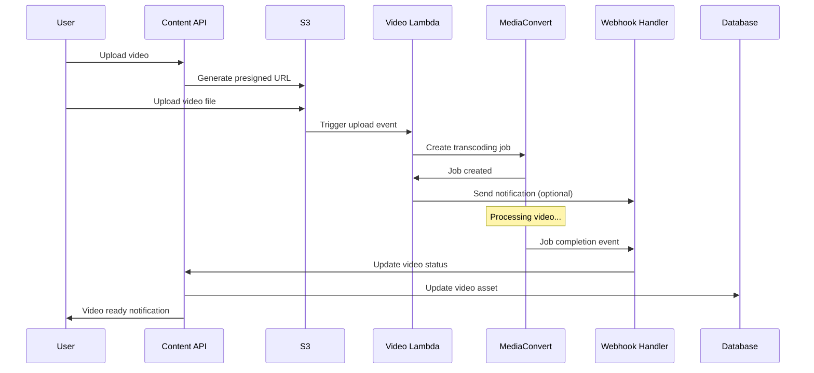

# AWS MediaConvert Integration

This document describes the AWS MediaConvert integration for video processing in the learning platform backend.

## Overview

The MediaConvert integration provides automated video transcoding capabilities that convert uploaded videos into multiple resolutions for adaptive bitrate streaming using HLS (HTTP Live Streaming) format.

## Components

### 1. MediaConvert Service (`MediaConvertService`)

**Location**: `src/shared/services/MediaConvertService.ts`

**Purpose**: Handles direct communication with AWS MediaConvert API

**Key Features**:
- Creates transcoding jobs with multiple resolution outputs (1080p, 720p, 480p, 360p)
- Monitors job status and progress
- Generates HLS streaming format with adaptive bitrate
- Automatic thumbnail generation
- Comprehensive error handling and logging

**Configuration**:
```typescript
// Required environment variables
MEDIACONVERT_ENDPOINT=https://your-endpoint.mediaconvert.amazonaws.com
MEDIACONVERT_ROLE_ARN=arn:aws:iam::account:role/MediaConvertRole
MEDIACONVERT_QUEUE_ARN=arn:aws:mediaconvert:region:account:queues/Default
```

### 2. Video Processing Lambda (`VideoProcessingLambda`)

**Location**: `src/shared/services/VideoProcessingLambda.ts`

**Purpose**: AWS Lambda function triggered by S3 uploads to initiate video processing

**Trigger**: S3 ObjectCreated events for files in the `video/` prefix

**Workflow**:
1. Receives S3 upload notification
2. Validates file is a video format
3. Creates MediaConvert transcoding job
4. Sends webhook notification (optional)

**Deployment**: Use `scripts/deploy-video-processing-lambda.ts`

### 3. Webhook Handler (`MediaConvertWebhookHandler`)

**Location**: `src/shared/services/MediaConvertWebhookHandler.ts`

**Purpose**: Processes MediaConvert job completion webhooks

**Endpoint**: `POST /webhooks/mediaconvert`

**Events Handled**:
- Job completion (success/failure)
- Job progress updates
- Job cancellation
- Job submission confirmation

### 4. Content Service Integration

**Location**: `src/modules/content/application/services/ContentService.ts`

**Integration Points**:
- `handleVideoUpload()`: Initiates MediaConvert job after S3 upload
- `handleTranscodingComplete()`: Updates video asset status after processing

## Video Processing Workflow



## Output Format

MediaConvert generates the following outputs for each video:

### HLS Streaming Files
- **1080p**: 1920x1080, 5 Mbps bitrate
- **720p**: 1280x720, 3 Mbps bitrate  
- **480p**: 854x480, 1.5 Mbps bitrate
- **360p**: 640x360, 800 Kbps bitrate

### Additional Files
- Master playlist (`.m3u8`)
- Segment files (`.ts`)
- Thumbnails (optional)

### S3 Structure
```
video/
├── user-id/
│   └── 2024/01/
│       └── uuid-timestamp-filename.mp4          # Original
│       └── uuid-timestamp-filename_processed/   # Processed outputs
│           ├── hls/
│           │   ├── master.m3u8
│           │   ├── 1080p.m3u8
│           │   ├── 720p.m3u8
│           │   ├── 480p.m3u8
│           │   ├── 360p.m3u8
│           │   └── segments/
│           └── thumbnails/
```

## Configuration

### AWS IAM Role for MediaConvert

The MediaConvert service requires an IAM role with the following permissions:

```json
{
  "Version": "2012-10-17",
  "Statement": [
    {
      "Effect": "Allow",
      "Action": [
        "s3:GetObject",
        "s3:PutObject"
      ],
      "Resource": "arn:aws:s3:::your-bucket/*"
    },
    {
      "Effect": "Allow",
      "Action": [
        "s3:ListBucket"
      ],
      "Resource": "arn:aws:s3:::your-bucket"
    }
  ]
}
```

### Lambda Function Permissions

The Lambda function requires:

```json
{
  "Version": "2012-10-17",
  "Statement": [
    {
      "Effect": "Allow",
      "Action": [
        "s3:GetObject"
      ],
      "Resource": "arn:aws:s3:::your-bucket/*"
    },
    {
      "Effect": "Allow",
      "Action": [
        "mediaconvert:CreateJob",
        "mediaconvert:GetJob",
        "mediaconvert:DescribeEndpoints"
      ],
      "Resource": "*"
    },
    {
      "Effect": "Allow",
      "Action": "iam:PassRole",
      "Resource": "arn:aws:iam::account:role/MediaConvertRole"
    }
  ]
}
```

## Error Handling

### Common Errors

1. **Invalid Input Format**: Non-video files are skipped
2. **MediaConvert API Errors**: Logged and retried with exponential backoff
3. **Processing Failures**: Video status updated to 'failed' with error message
4. **Webhook Failures**: Don't fail the main process, logged for monitoring

### Monitoring

- All operations are logged with structured logging
- CloudWatch metrics for job success/failure rates
- Alerts for high failure rates or stuck jobs

## Testing

### Unit Tests
```bash
npm test -- MediaConvertService.test.ts
```

### Integration Testing
1. Upload a test video file
2. Monitor CloudWatch logs for Lambda execution
3. Check MediaConvert console for job status
4. Verify processed files in S3
5. Test video playback with generated URLs

## Deployment

### 1. Deploy Lambda Function
```bash
npm run deploy:lambda
```

### 2. Configure S3 Bucket Notifications
```bash
aws s3api put-bucket-notification-configuration \
  --bucket your-bucket \
  --notification-configuration file://notification-config.json
```

### 3. Set Up MediaConvert Webhook
Configure CloudWatch Events to send MediaConvert job state changes to your webhook endpoint.

## Performance Considerations

- **Concurrent Jobs**: MediaConvert has service limits on concurrent jobs
- **Processing Time**: Varies by video length and complexity (typically 0.3x to 1x real-time)
- **Cost Optimization**: Use appropriate quality settings for your use case
- **Storage**: Consider lifecycle policies for processed files

## Security

- All S3 URLs are signed with expiration times
- Webhook signatures should be validated in production
- IAM roles follow principle of least privilege
- Video access controlled by enrollment status

## Troubleshooting

### Common Issues

1. **Jobs Stuck in SUBMITTED**: Check MediaConvert queue capacity
2. **Processing Failures**: Verify input file format and S3 permissions
3. **Webhook Not Received**: Check CloudWatch Events configuration
4. **Lambda Timeouts**: Increase timeout for large files

### Debug Steps

1. Check CloudWatch logs for Lambda function
2. Monitor MediaConvert job status in AWS console
3. Verify S3 bucket permissions and file existence
4. Test webhook endpoint manually
5. Check database for processing job records